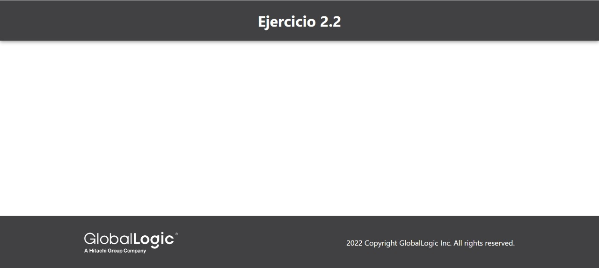
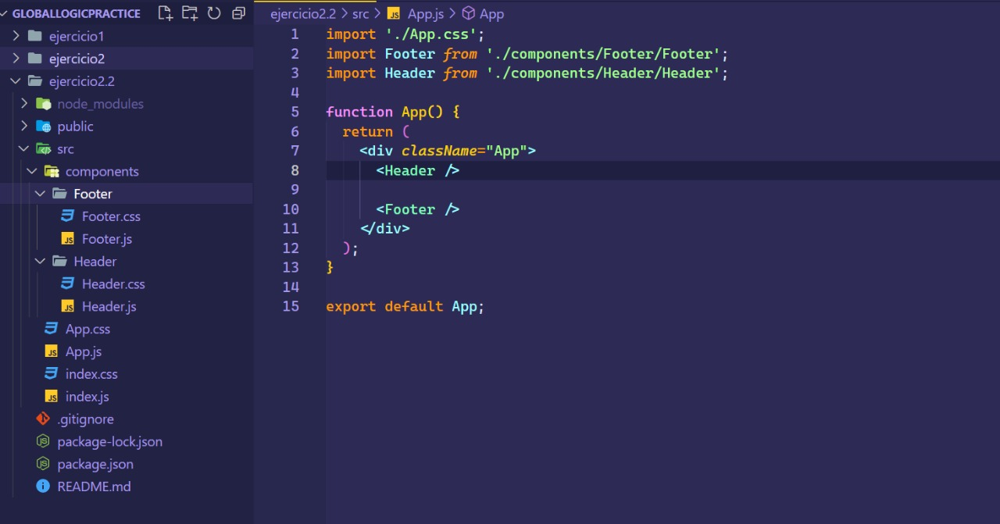
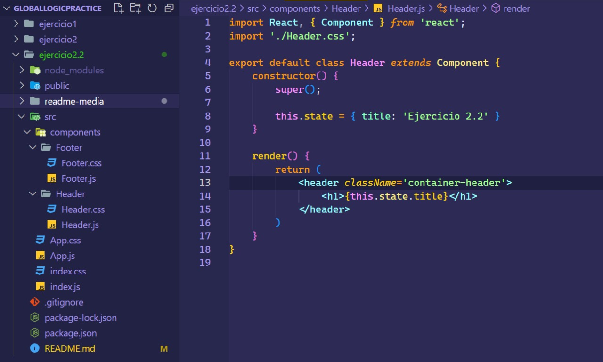
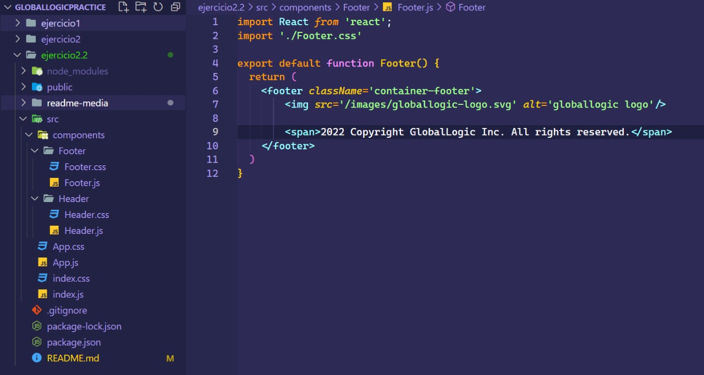

# Ejercicio 2.2

````
Se deben crear 2 componentes:
    - header: un header standard, donde el titulo de pagina se encuentre en el state de la component (componente de clase)

    - footer: contiene el copyright, estatico (componente funcional, sin estado)
    Ambas componentes se incluirán en el App.js

````

<br>

## Resultado



<br>

## Código
### App



<br>

### Header (Class component)



<br>

### Footer (Functional component)

