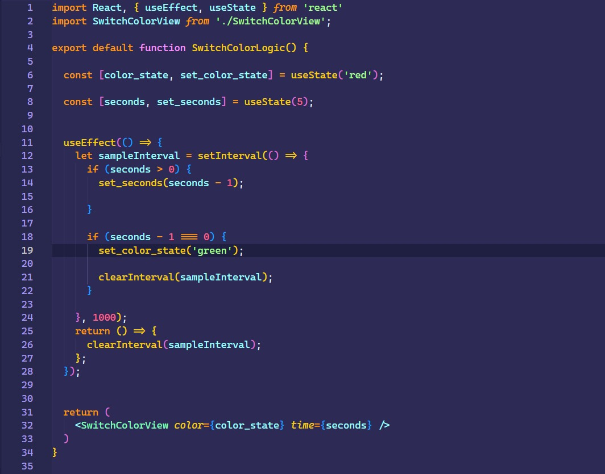
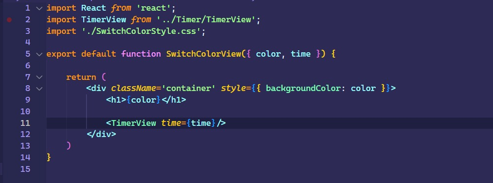

# Ejercicio 2

````
    - Pasados 5 segundos actualice el state 

    - La componente tendrá en su estado la palabra “red” al inicio

    - Pasados 5 segundos, se transformara la palabra “red” en “green”

````

<br>

## Resultado


<br>

## Código

### SwitchColor

<p>Aqui se aloja la lógica del componente</p>



<br>

### SwitchColorView

<p>Aqui se aloja la vista del componente</p>



<br>

### TimerView

<p>Mi objetivo con este pequeño fragmento es practicar la modularización</p>

