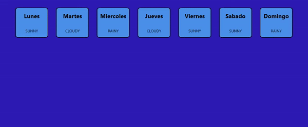
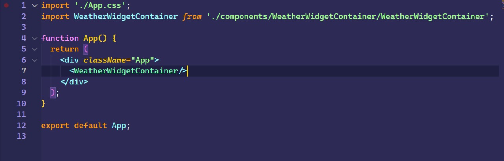
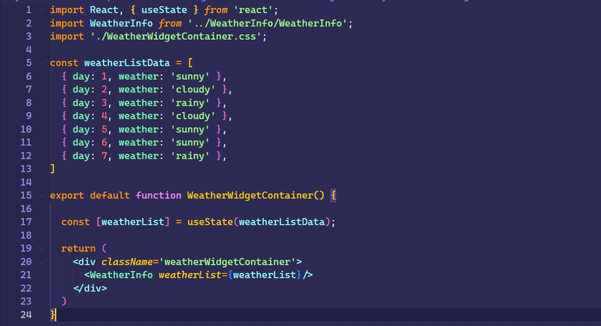
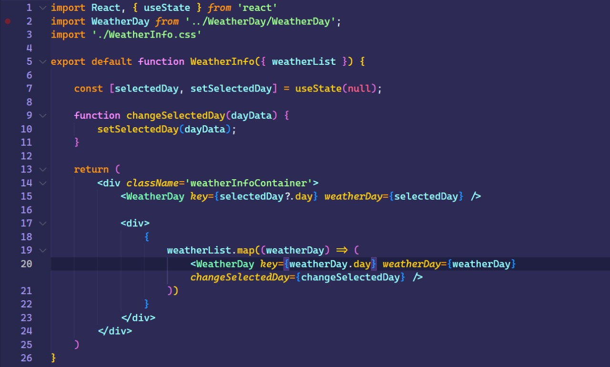
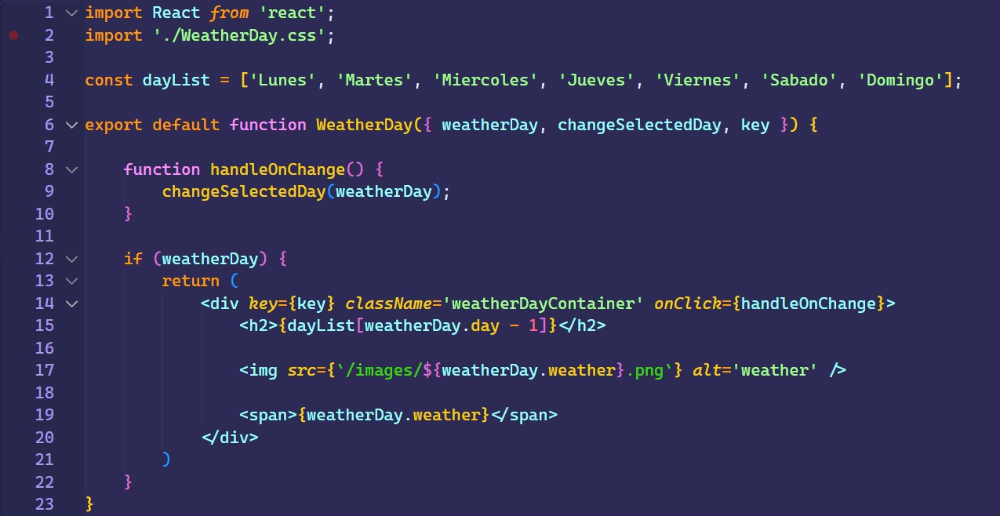

# Ejercicio 2.3

````
Se debe crear 3 componentes, con la siguiente arquitectura. Donde se muestra una lista de días, con su clima

    - Weather Widget Container: contiene un arreglo de dias ej: {day: 1, weather: “sunny”}

    - Weather Info: muestra el día seleccionado en el título y hace render de la lista de días

    - Weather Day: hace render del objeto, al hacer un click en un dia, lo envia a “weather info” {day: 1, weather: “sunny”}


    - Extra mile: que muestre un sol, nubes o lluvia con una imagen

````

<br>

## Resultado



<br>

## Código
### App



<br>

### WeatherWidgetContainer



<br>

### WeatherInfo



<br>

### WeatherDay



<br>