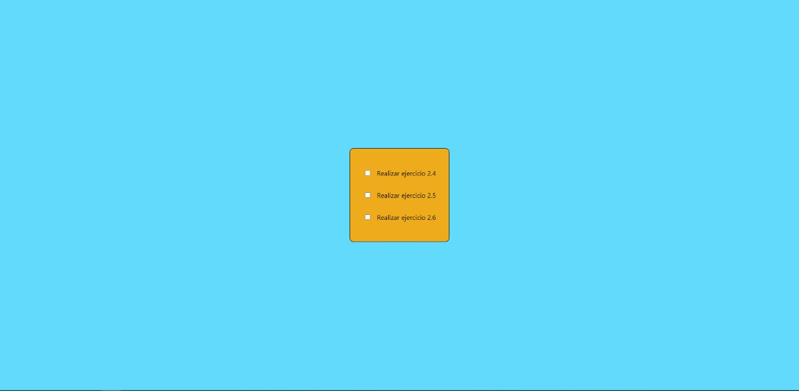
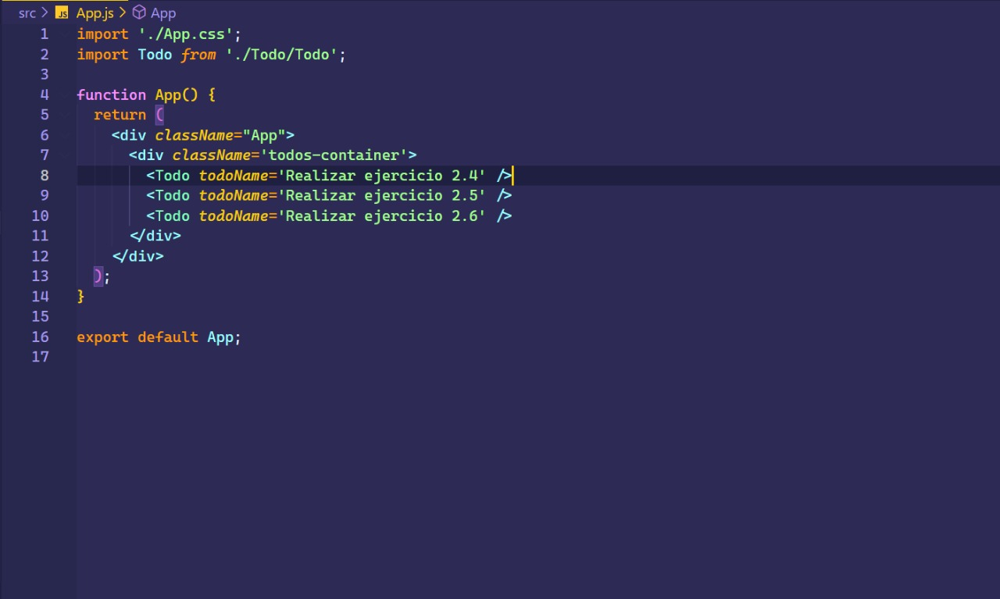
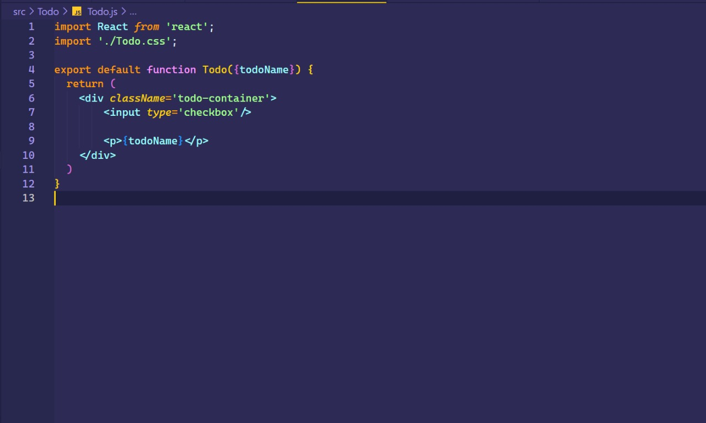

# Ejercicio 2.4

````
    - Inicializar una aplicación de React con npx

    - Debera contener un componente “app”

    - Agregar 3 checkbox, con un párrafo al lado de cada uno, simulando “to-do items”

    - Para este ejercicio se usará CRA (Create React App)

````

<br>

## Resultado 



<br>

## Código

### App



<br>

### Todo

