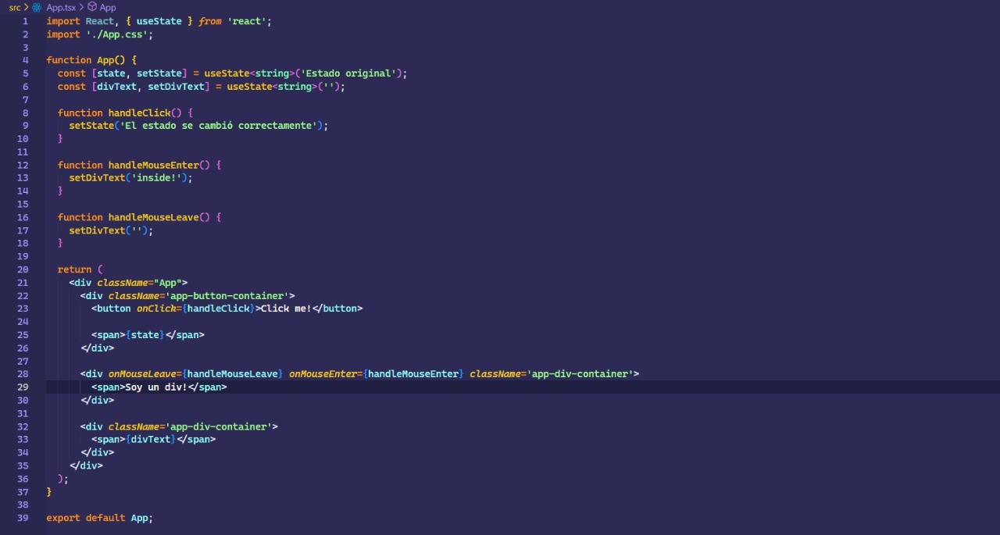

# Ejercicio 2.5

````
    - Tener un boton, que al hacer click cambie el estado interno de esa componente (verificar el estado con las react dev tools)

    - Tener un <div> que contenga un texto: al pasar el mouse por arriba deberá agregar un texto que diga “inside” en otro div. Al perder foco, se deberá hacer desaparecer el texto de “inside”

````

<br>

## Resultado


<br>

## Código

