# Ejercicio 2.6

````
Con el fin de : comprender librerías de css-in-js de React, el techCamp se dividira en 3 grupos donde se analizaran 3 librerías diferentes de css-in-js :

    - Material UI (Ya que wix style react no me funcionaba elegi una libreria parecida)
    - Styled-components
    - Radium

Teniendo como tareas:
    - comprender la librería
    - entender en forma teórica el funcionamiento de la misma
    - desarrollar una POC simple
    - Explicar a todos el funcionamiento de la misma (con pros & cons)

````

# Resultado

### Material UI
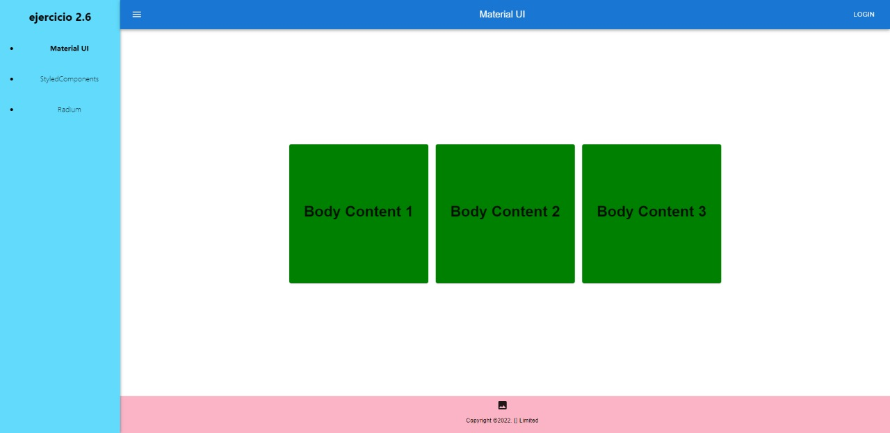

<p>Pro: Note bastante facilidad al usar componentes</p>

<br>

<p>Contra: Las paginas suelen tener diseños parecidos</p>

<br>

<hr>

### Styled Components
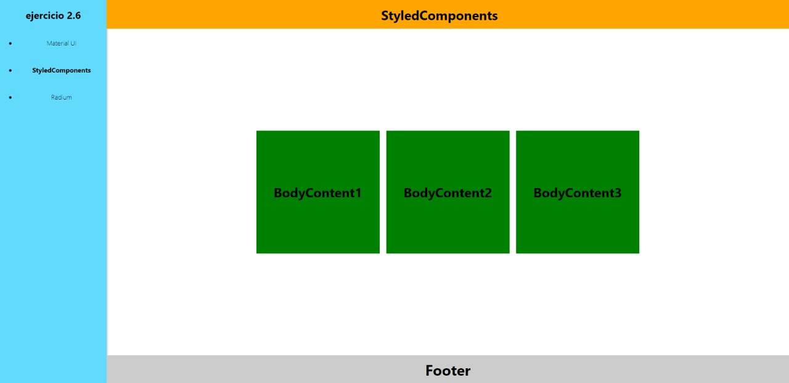

<p>Pro: Como en material UI tuve bastante facilidad al usar componentes y flexibilidad a la hora de dar estilos</p>

<br>

<p>Contra: Sumamente necesaria la modularización</p>

<br>

<hr>

### Radium
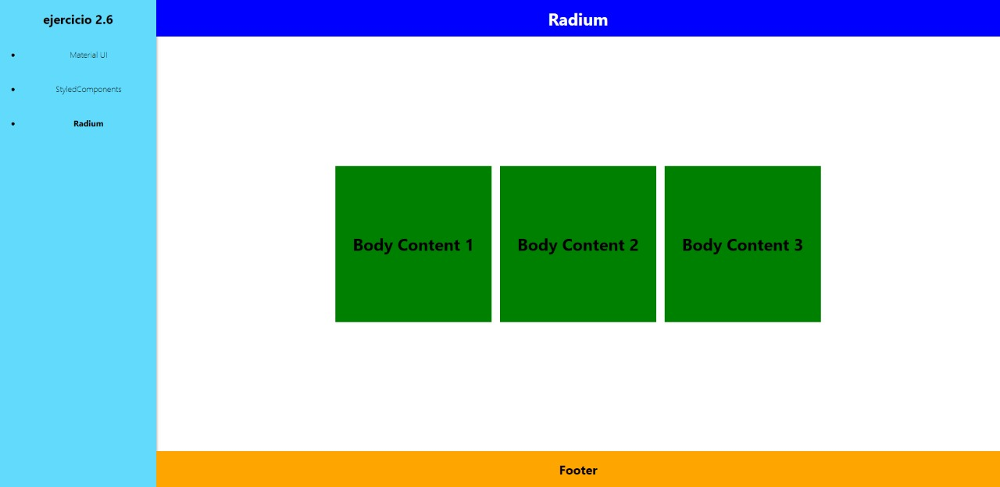

<p>Pro: Facil de usar</p>

<br>

<p>Contra: Es mas probable que se sature la linea con estilos y no se puede dar estilos a componentes hijos / hermanos de forma sencilla</p>

<br>

<hr>

## Código

### App

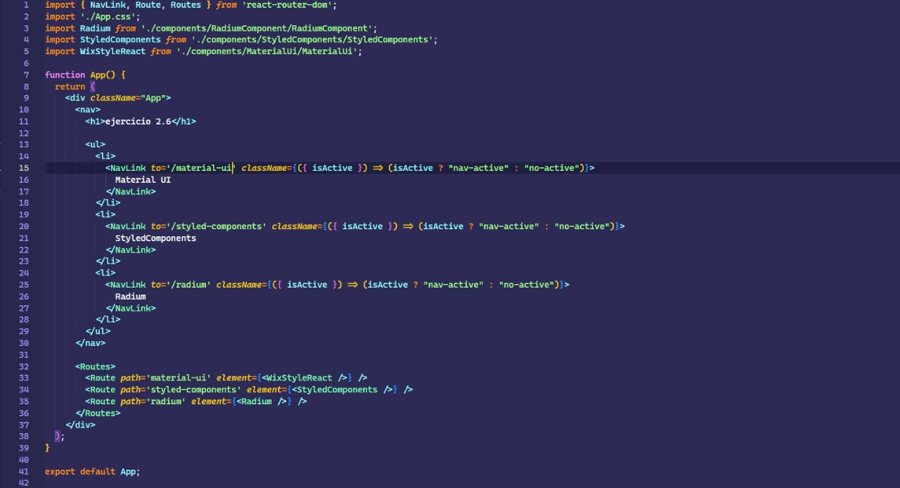

<br>

### MaterialUI

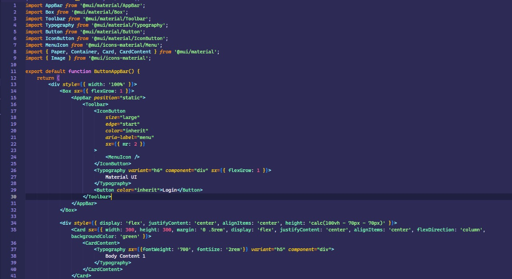
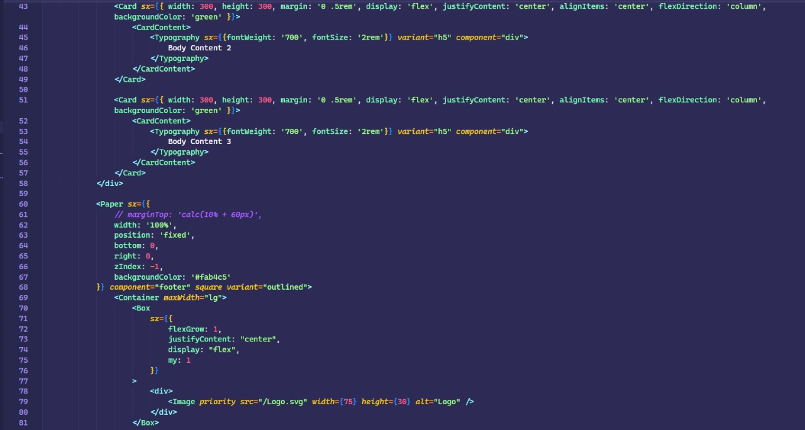
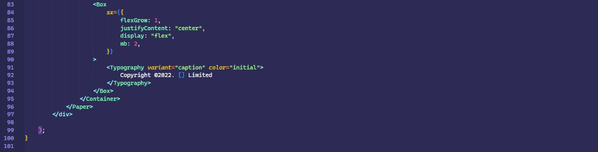

<br>

### Radium

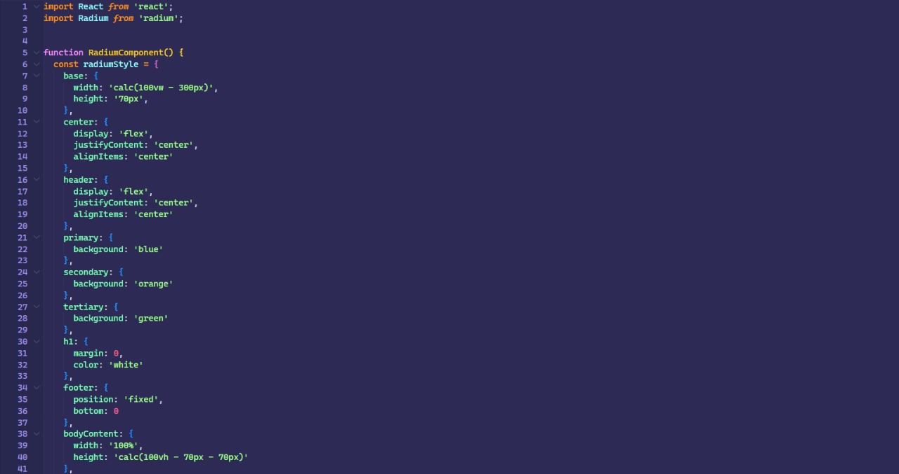
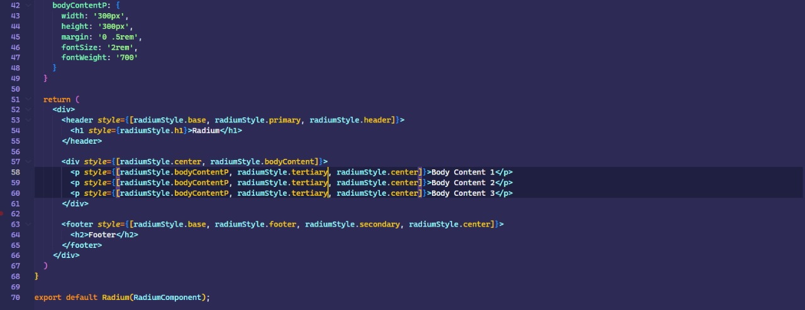

<br>

### Styled Components

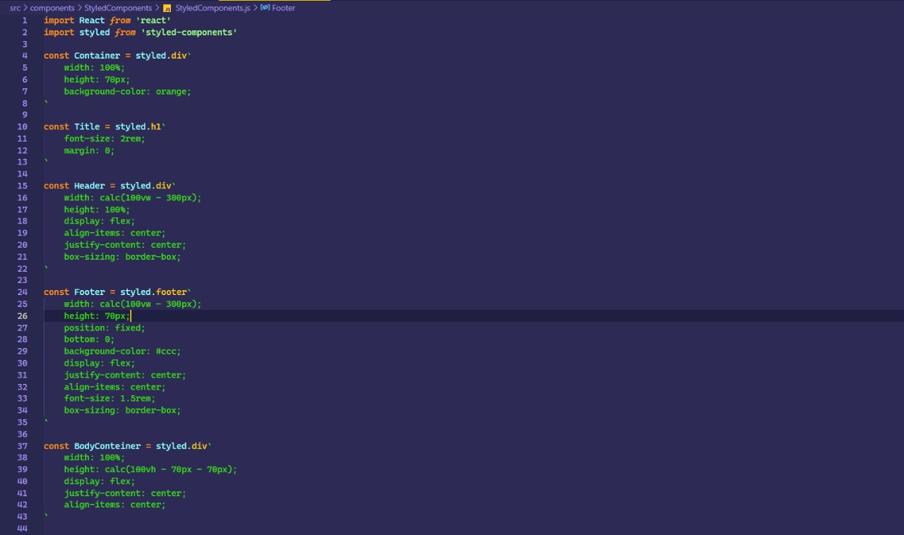
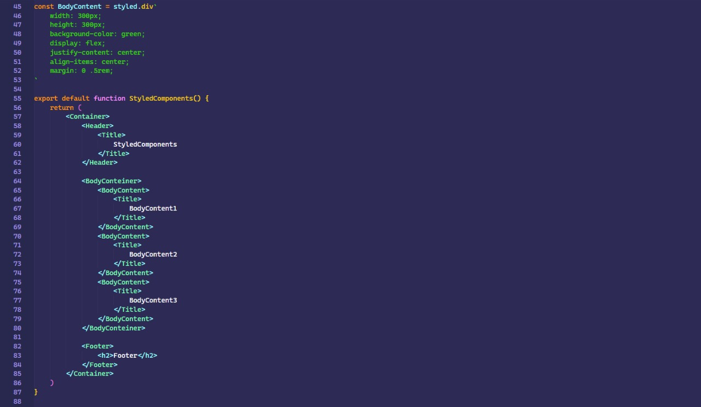
