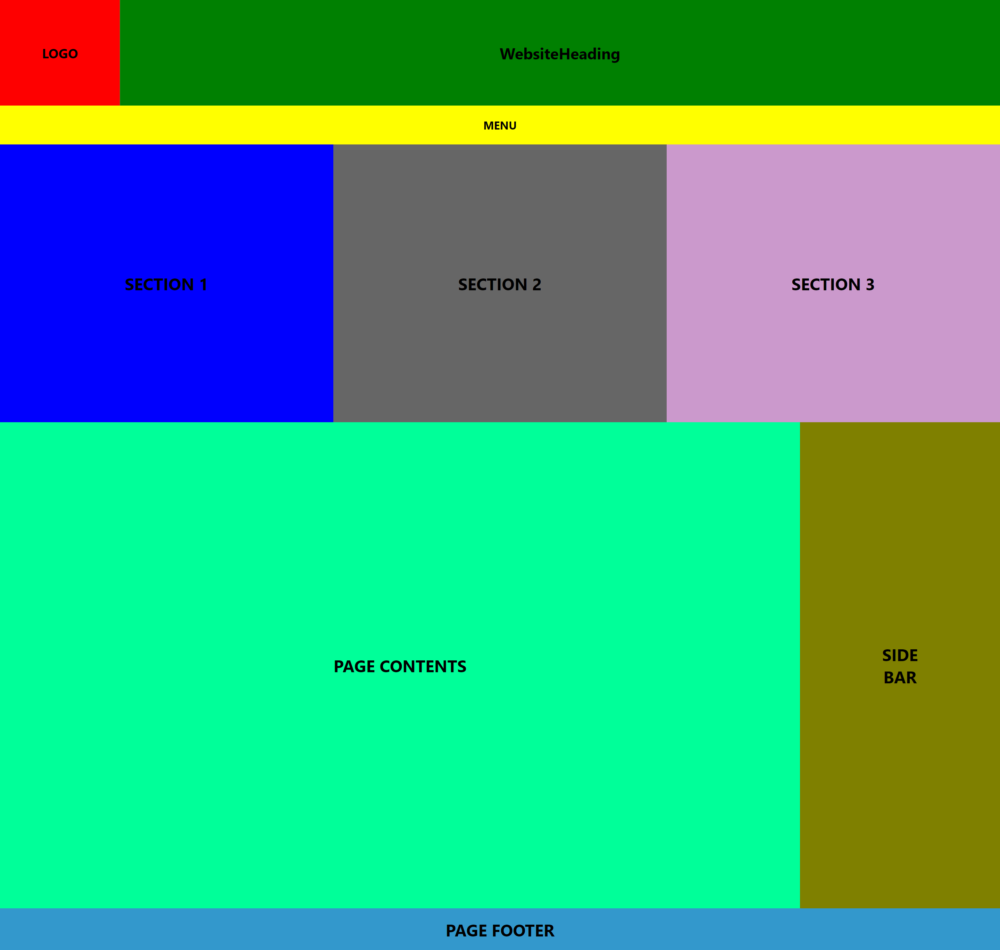
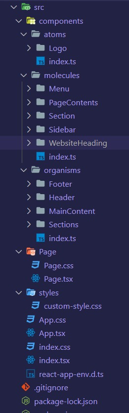
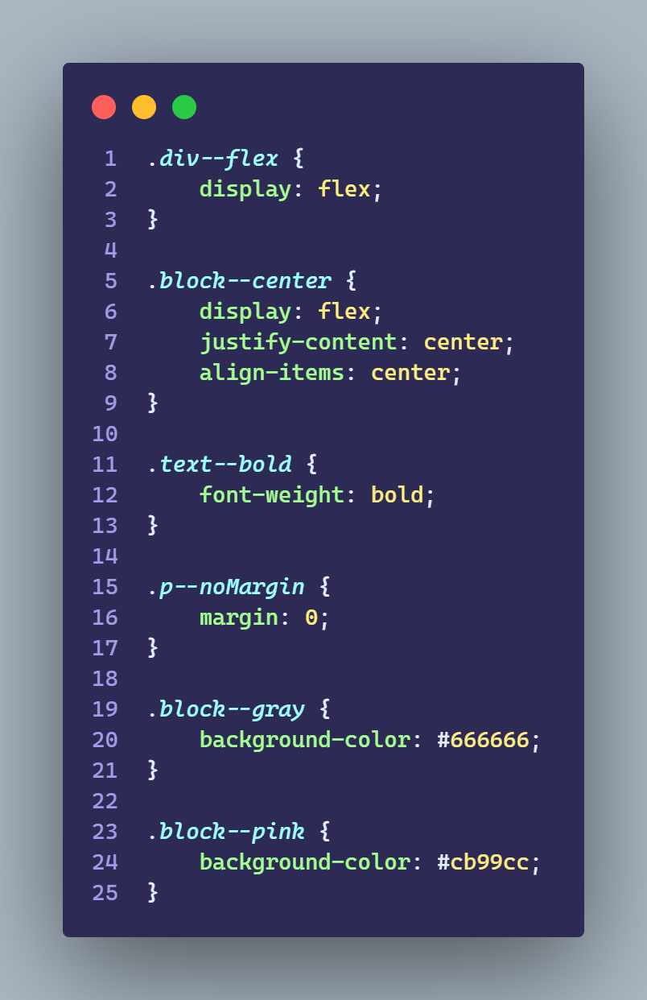
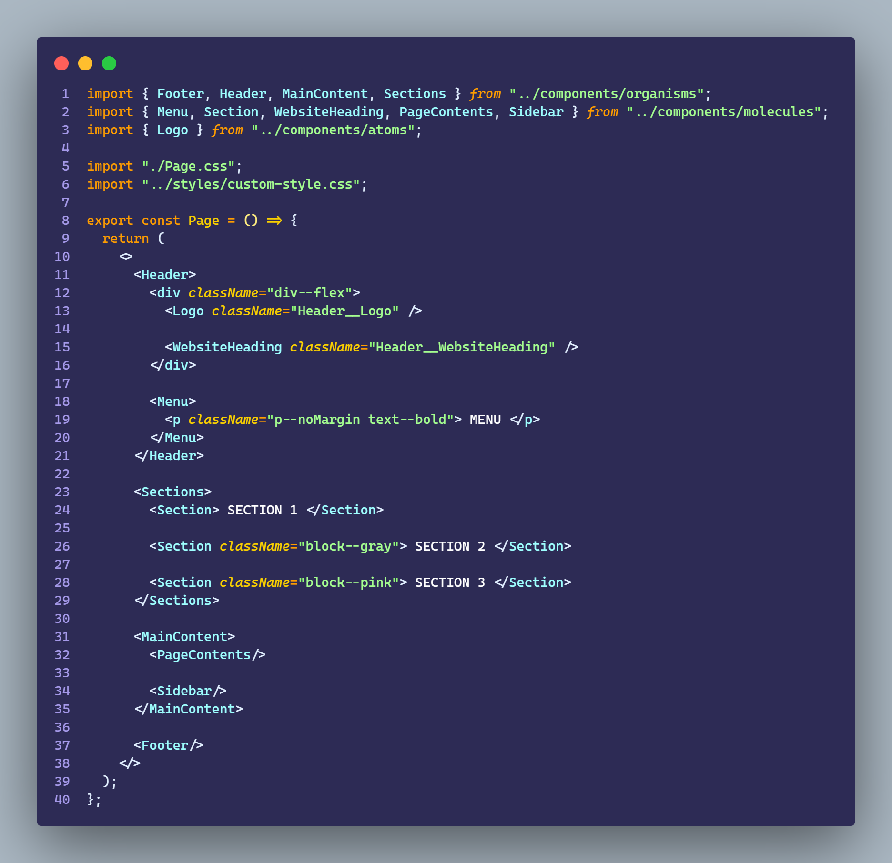

# Ejercicio 2.7

````
    - Con el fin de comprender cómo funcionan los estilos, componentes y comprender las ventajas y problemas de alguna de las formas de aplicar estilos en React, se debe desarrollar una app que tenga la siguiente estructura, con colores y estilos.

    - Se tendrá foco en la modularización y aplicado de estilos

    - Se usaran “CSS stylesheets” y una de las 3 metodologías CSS (OOCSS, BEM o SMACSS)

````

## Resultado



<br>

## Estructura del proyecto - Atomic Design

````
Se me ocurrió practicar la metodología de Atomic Design

    - En la parte de componentes hay 3 grupos
        - Los Atomos: La unidad mas pequeña de elementos necesarios para armar la UI

        - Las Molecules: Conjunto de Atomos

        - Los Organismos: Conjunto de Moleculas

    Cada uno de estos grupos contiene un archivo index donde se exportaran todos los elementos del grupo

    Por último esta la carpeta Page donde se unen todos los elementos necesarios para armar una interfaz
````



<br>

## Metodología de estilos - BEM

````
Elegí usar la metodologia BEM para los estilos

    - Cada componente cuentas con su archivo CSS para los estilos base

    - Creé un archivo llamado "custom-style.css" donde hay estilos que se suelen repetir

    - Los componentes pueden recibir clases mediante props ademas de tener las propias
````

### custom-style.css



<br>

### Page.css


<br>

### Page.tsx

