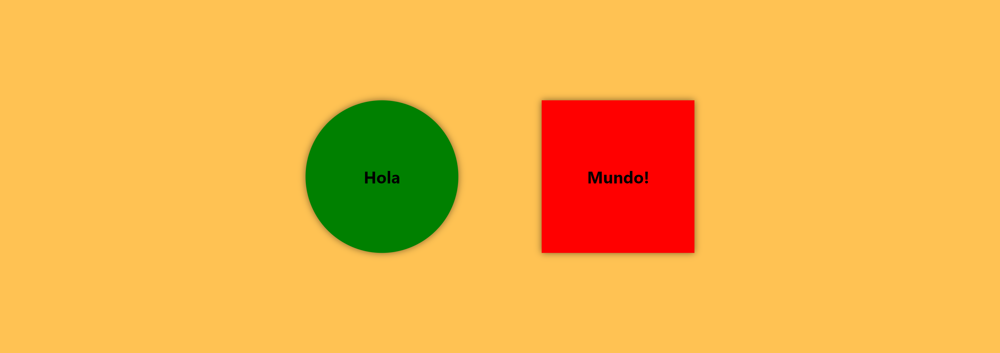
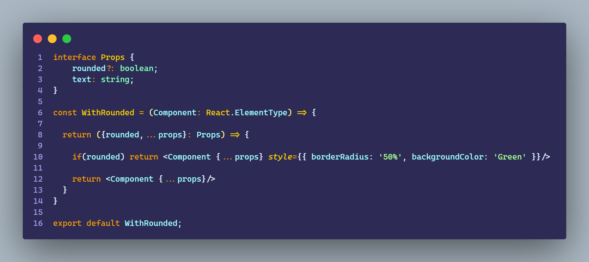
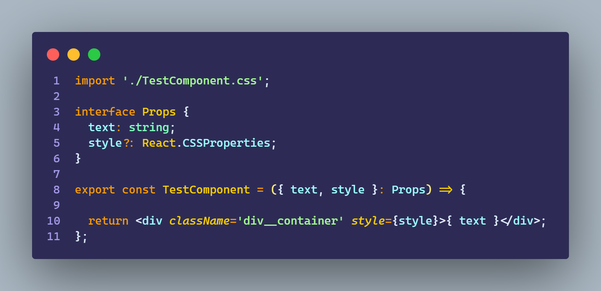
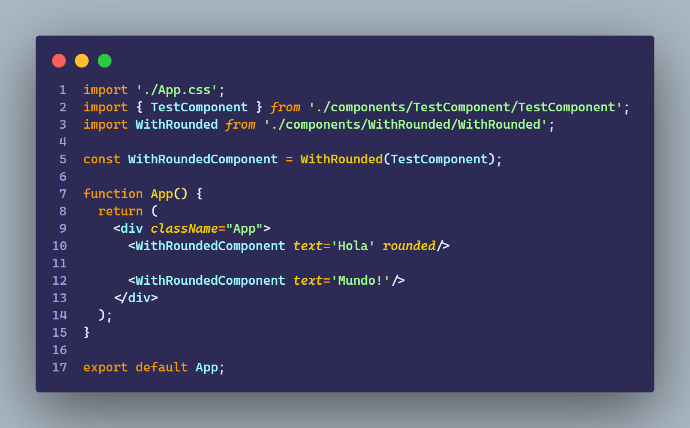

# Ejercicio 3.1

````
Crear una app que tenga :

    - App component

    - una HOC que haga de wrapper y tenga un text con un parámetro que sirva para:

        - cree un div con esquinas redondas (circulo)

        - cree un div con esquinas cuadradas

    - una componente que use la HOC con texto “hola” en redondo

    - una componente que use la HOC con texto “mundo”, en cuadrado
````

<br>

## Resultado



<br>

## WithRounded



<br>

## TestComponent



<br>

## App

