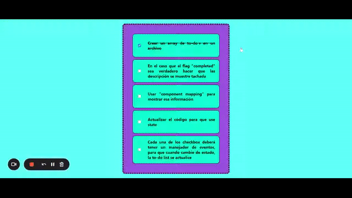
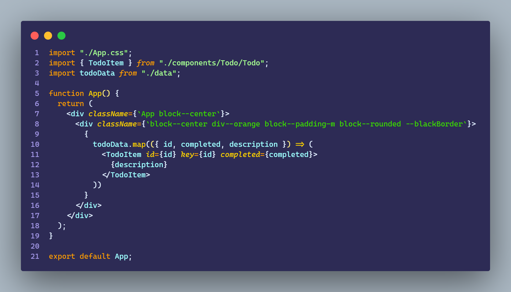
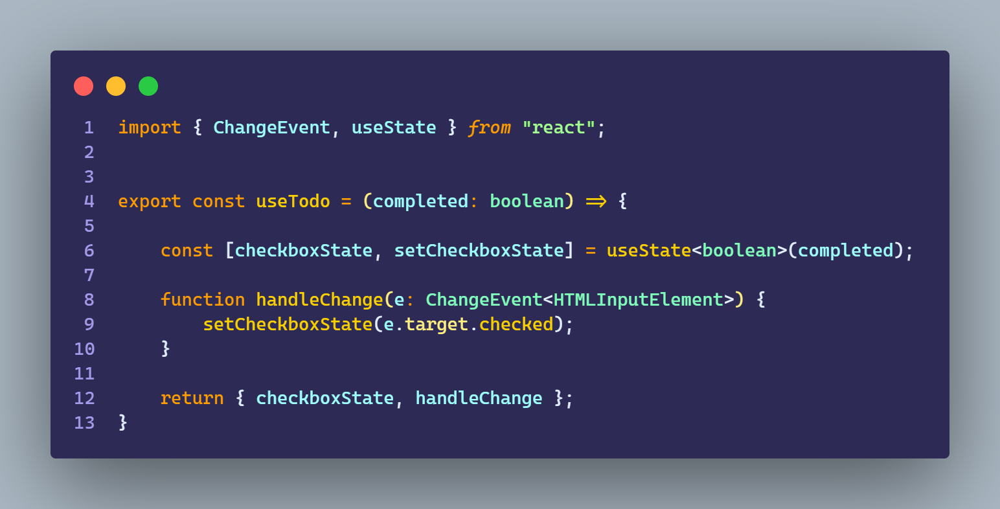
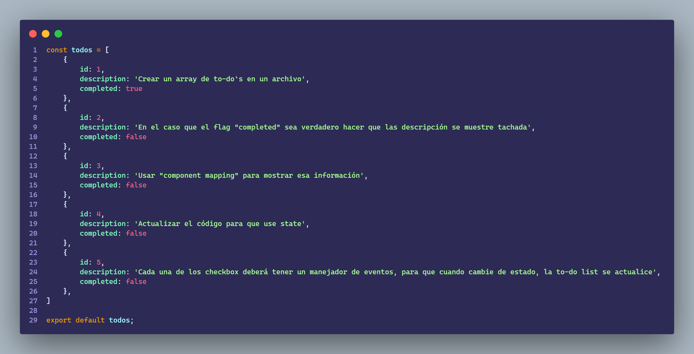

# Ejercicio 3.2

````
    - Extraer toda la información de los to-do’s a un archivo (crear un arreglo de to-do’s). 

    - En el caso de que el flag “completed” sea verdadero, hacer que la descripción se muestro tachada.

    - Usar “component mapping” para mostrar esa información.

    - Actualizar el código para que use state.
    
    - Cada uno de los checkbox deberá tener un manejador de eventos, para que cuando cambie de estado, la to-do list se actualice.

````

## Resultado



<br>

## App



<br>

## Todo


<br>

## UseTodo



<br>

## Todo Data



<br>