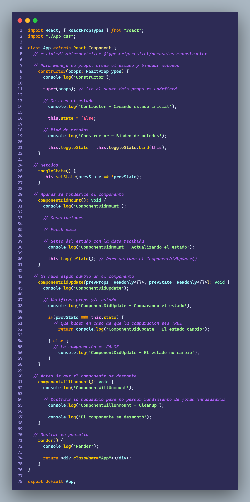
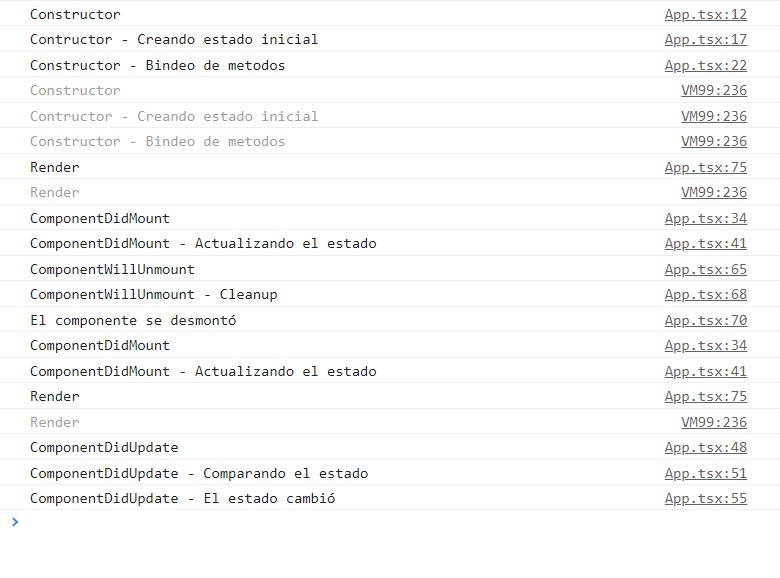

# Ejercicio 3.3

````
Se debe crear una app en React que ejecute lo siguiente:

     - Una componente que disponga de los siguientes métodos y haga console.log() de cada evento que ejecuta.

        - constructor()

        - render()

        - componentDidMount()

        - componentDidUpdate()

        - componentWillUnmount()

    - Para forzar re-render se puede usar un setTimeout
````

## App



<br>

## Resultado

