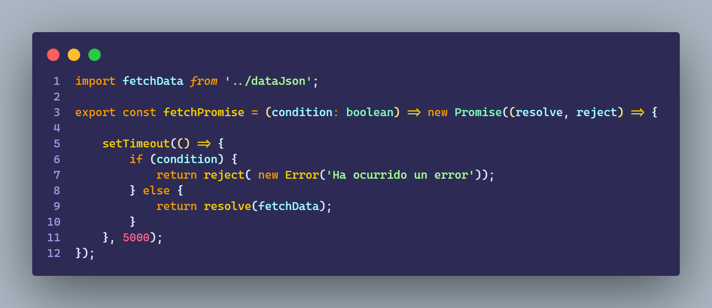

# Ejercicio 3.4

````
    - Crear una app que tenga un mensaje de “loading” al principio.

    - Simular una llamada a servicios, con un setTimeout de 5 segundos, que va a disparar un “stop” al loading.

    - Al ejecutar el stop al loading, la app deberá cambiar el mensaje usando conditional render.

````

## Resultado - Exito


<br>

## Resultado - Error


<br>

### App


<br>

### Card


<br>

### UseData


<br>

### Util



<br>

### UseButton


<br>