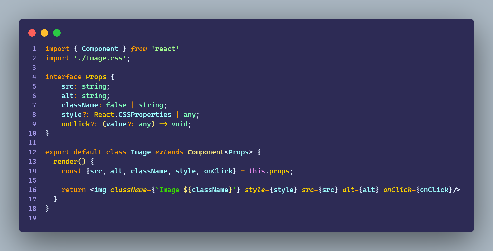

# Ejercicio 3.6

````
Crear un proyecto desde cero en React

    - La app deberia tener:
        - Header
        - Footer
        - Contenido

    - Una clase debería servir al propósito de guardar el estado del MemeGenerator (smart component)

    - State: el meme (top-text, bottom-text, imagen)

    • Para obtener las imágenes se usará la API de ImgFlip ( https://api.imgflip.com/ ) 

    • El servicio que llamaremos: https://api.imgflip.com/get_memes 

    • El memeGenerator tendra 2 partes: 
        - un componente smart
        - un componente dumb (presentacional)

    • El componente presentacional tendrá: 
        - 2 inputs (uno para top text, otro para bottom text)  y un botón para generar el meme
        - Una parte de la app estará dedicada a mostrar el meme (el top text, bottom text y la imagen)
        - Al hacer click en el botón para generar el meme, se deberá elegir una imagen random del arreglo de imágenes del servicio y mostrarlo en la parte de contenido (junto con los textos)

    • Creditos Extra: agregar estilos básicos a botones, input, header, footer, etc

````

<br>

## Resultado

https://user-images.githubusercontent.com/85971126/191218387-62d1ed3b-44af-4e48-bac3-96668f3d756e.mp4

<br>

## MemeGeneratorContainer


<br>

## MemeGenerator


<br>

## Inputs


<br>

## PreviewMeme


<br>

## Image



<br>

## InputText


<br>

## HttpClient


<br>

## Interfaces


<br>

## App


<br>
