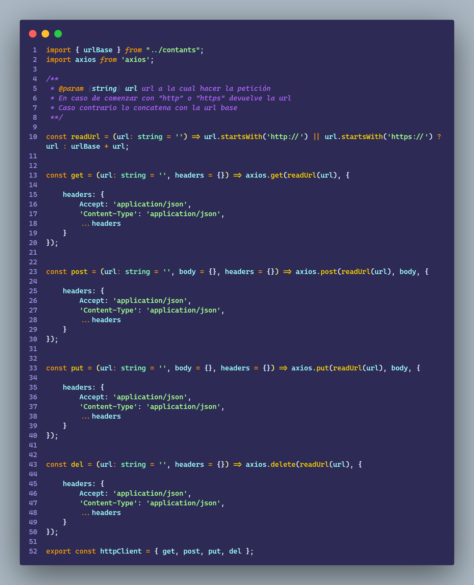
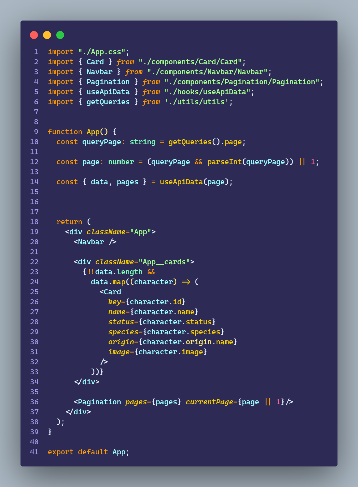
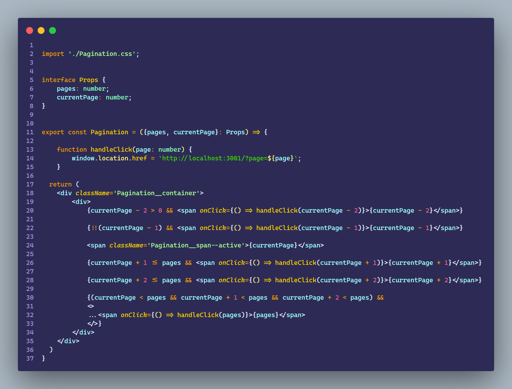
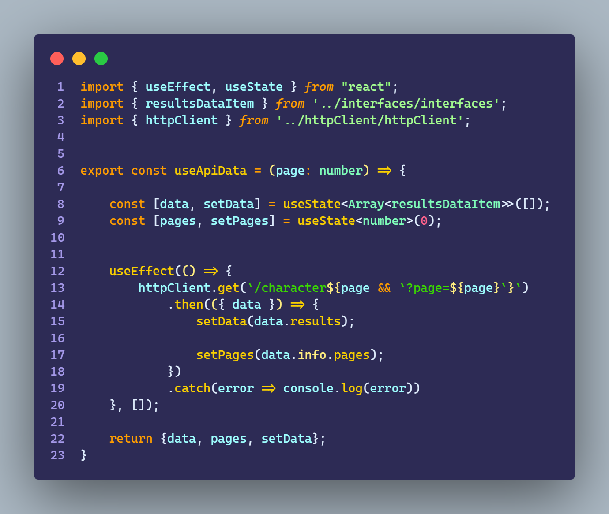

# Ejercicio Extra - Axios

````
    - Armar axios client con al menos la peticion GET.

    - Elegir una api publica para consumir y renderizar algun tipo de contenido de su response.
````

<br>

## Resultado

https://user-images.githubusercontent.com/85971126/191051485-a5dd1448-4356-409e-9955-ede7edd0fe76.mp4

<br>

### HttpClient



<br>

### App



<br>

### Card


<br>

### Pagination



<br>

### UseApiData



<br>
