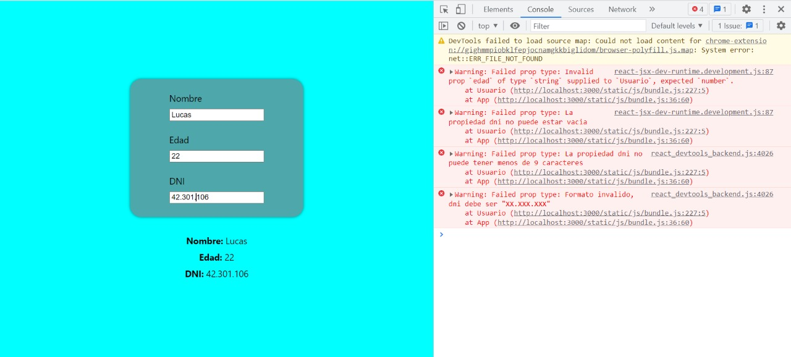
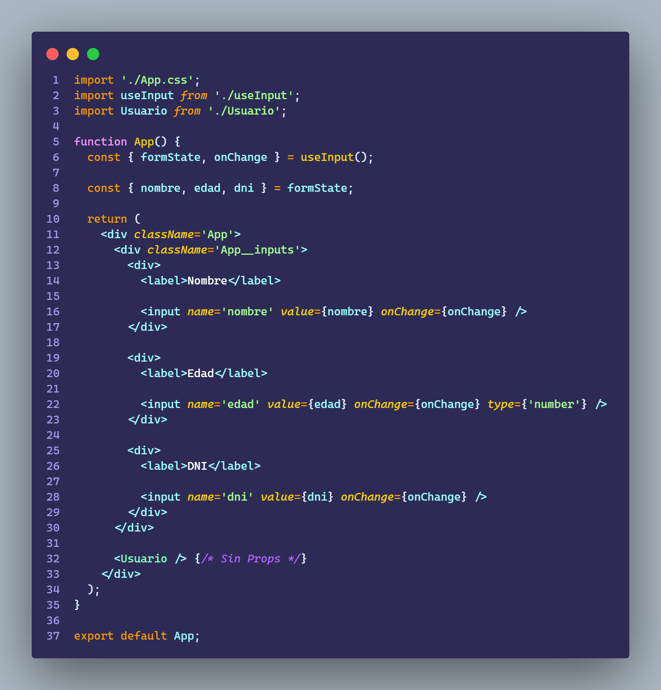
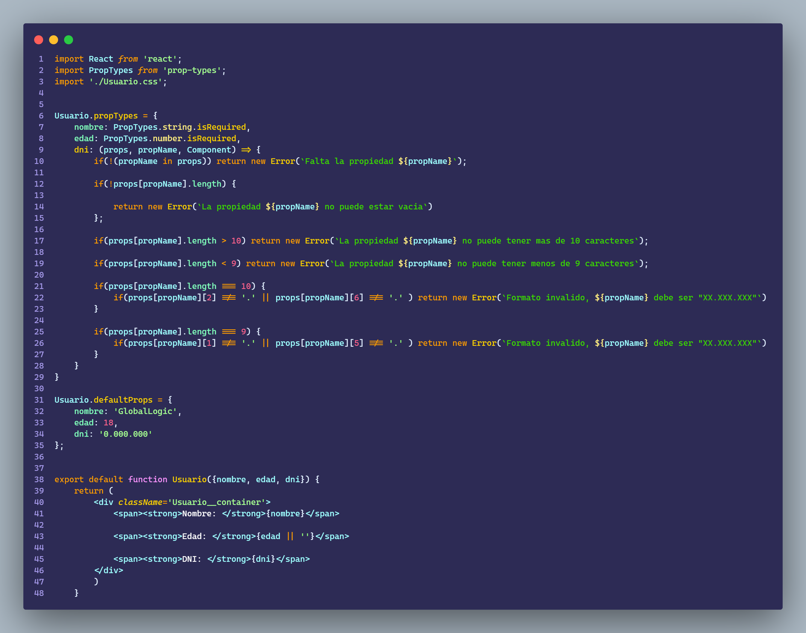
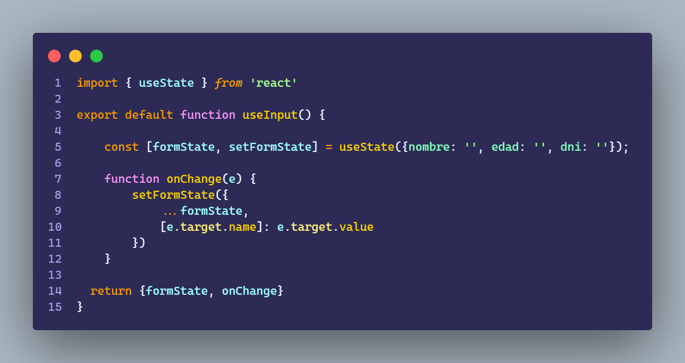
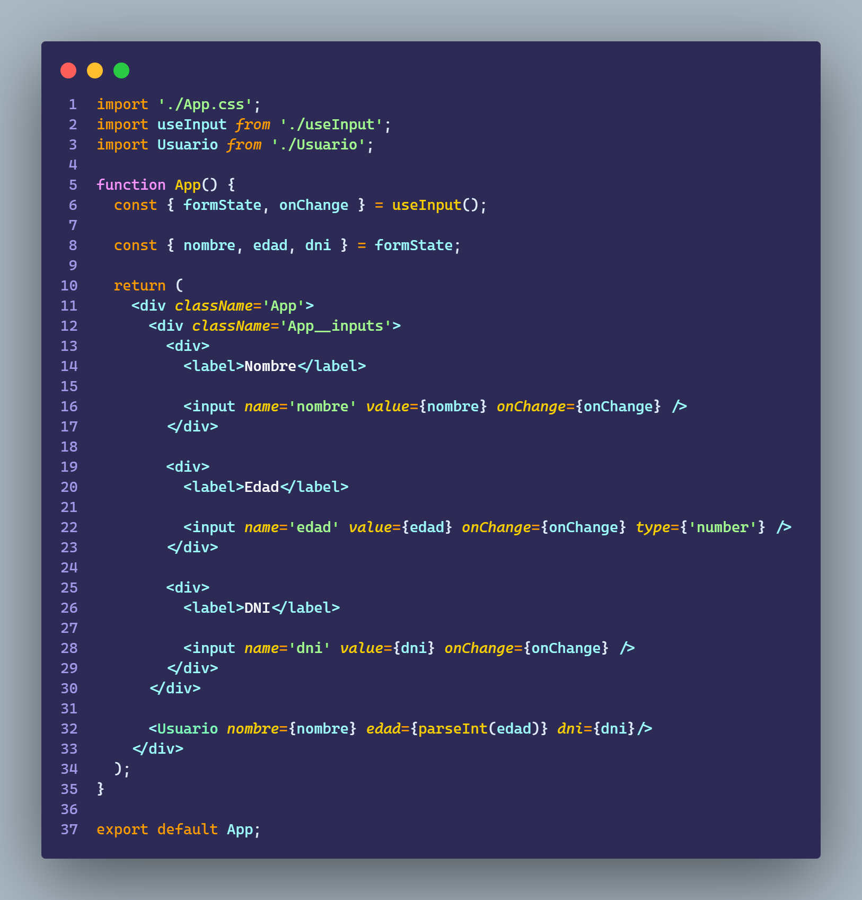

# Ejercicio 4.1 y 4.2

````
Crear una componente Usuario que reciba:
    - nombre
    - edad
    - dni

Usarla con prop-types y validando que:
    - nombre: sea string
    - edad: sea integer
    - dni: que sea del formato: XX.XXX.XXX (custom validation)

Se deberá modificar el ejercicio 4.1, para que en caso de no recibir props, debería mostrar los siguientes valores:
    ● nombre: GlobalLogic
    ● edad: 18
    ● dni: 0.000.000
````

## Resultado 4.1



<br>

# Resultado 4.2




<br>

## Usuario



<br>

## useInput



<br>

## App



<br>