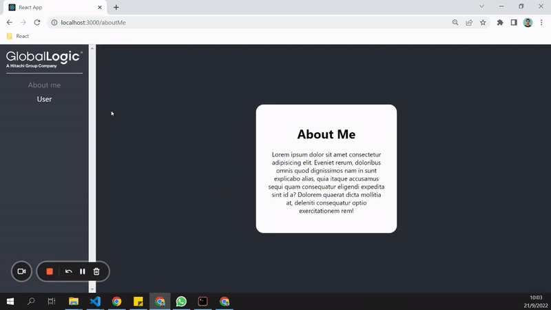
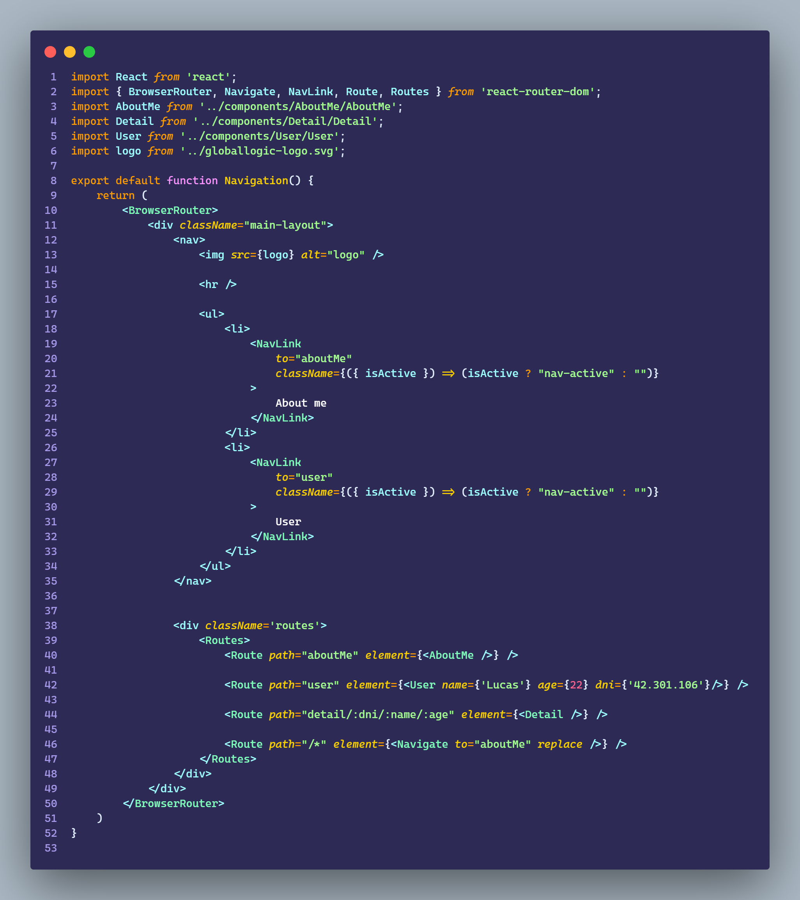
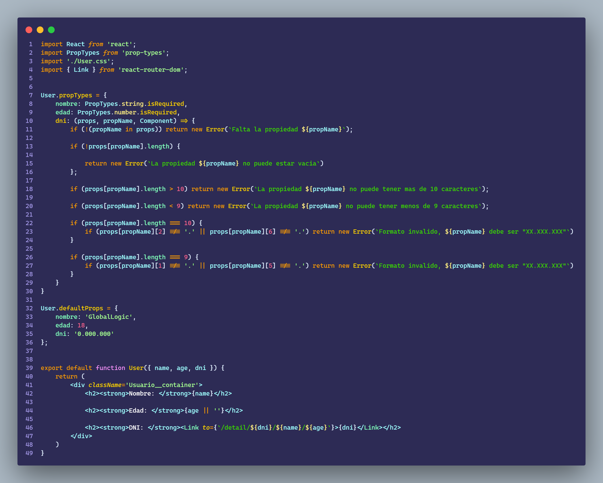
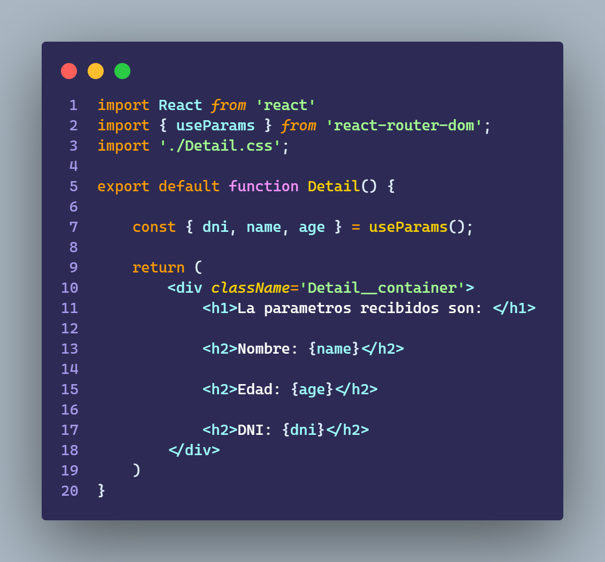
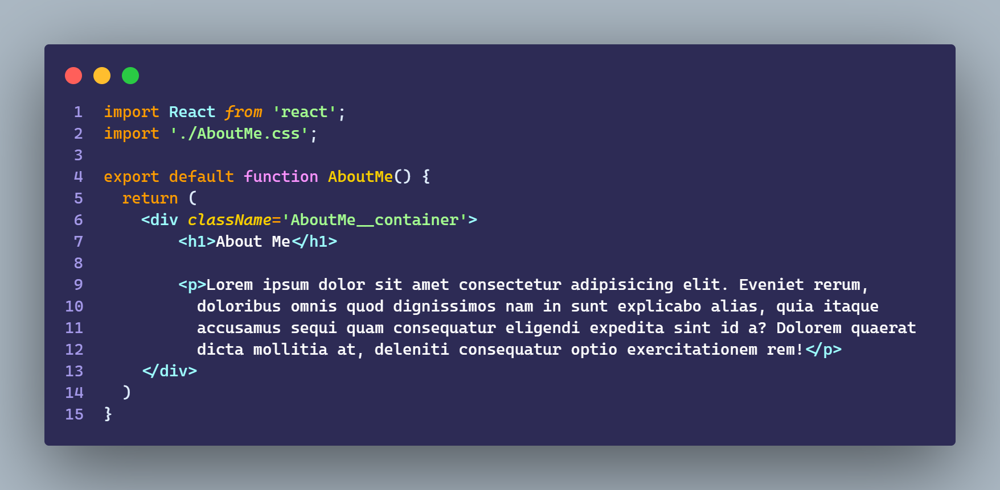

# Ejercicio 4.3

````
Continuando con el ejercicio 4.2, donde se agregaron las defaultProps, ahora
agregaremos a nuestro ejercicio de ejemplo routing.
El objetivo es crear otra componente “aboutMe” que muestre un texto de lorem
ipsum.

    La aplicación tendrá las siguientes características:
        - 2 rutas:
        - aboutMe : donde se muestra el texto de lorem ipsum
        - user : donde se muestra la componente de usuario
        - un <nav> que tenga links a ambas routes
        - se usara react-router-dom
        - 1 Ruta /detail/{id} que levante el dni del user que se pasa por url y lo muestre en un h1
````

<br>

## Resultado



<br>

## Navigation



<br>

## User



<br>

## Detail



<br>

## AboutMe



<br>