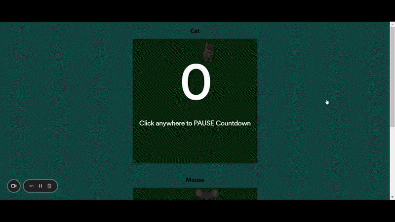
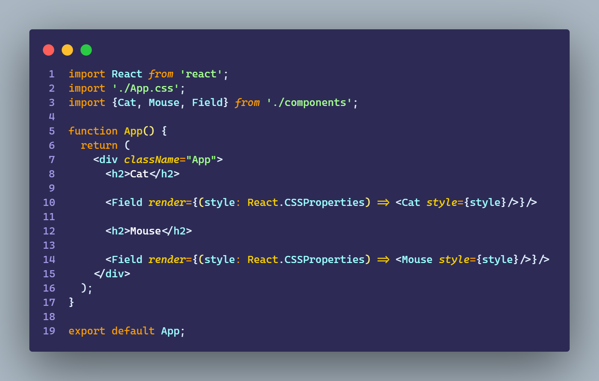
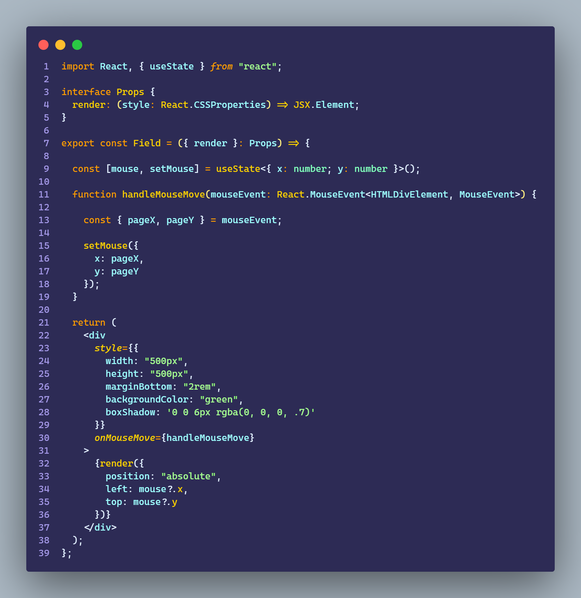
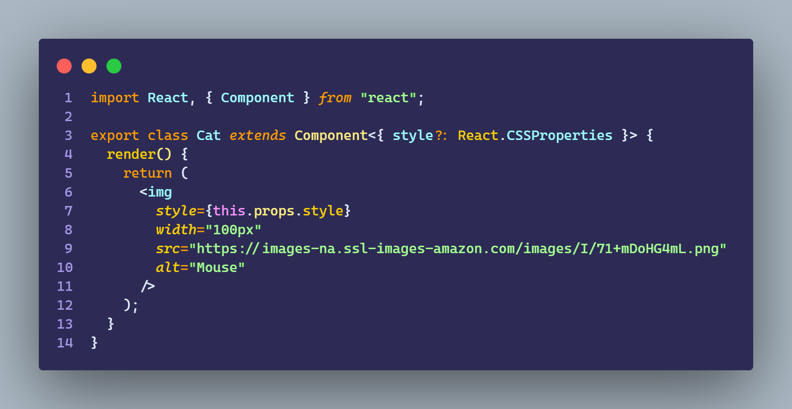
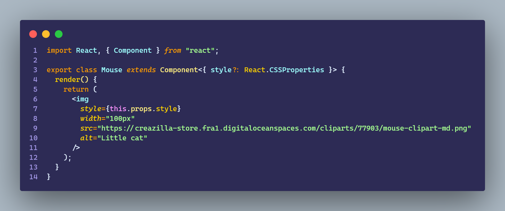

# Ejercicio 4.4

````
En este ejercicio vamos a poner en práctica el reuso a través de render props.
Crearemos una aplicación que tenga las siguientes clases:
    - Cat: representará la imagen de un gato

    - Mouse: representará la imagen de un ratón

    - Field: sera un div, de 500 x 500 px color verde

La clase Field estará a cargo de detectar las coordenadas del mouse y
pasarle las coordenadas X e Y a la componente Cat y Mouse.

Para ello la clase field usará una render prop y se mostrará en pantalla el Field
con un Cat y debajo otro Field con un Mouse.

Consejo:
    - tener en cuenta el posicionamiento de las imágenes de raton y gato

    style={{ position: 'absolute', left: mouse.x, top: mouse.y }}
````

## Resultado



<br>

## App



<br>

## Field



<br>

## Cat



<br>

## Mouse



<br>