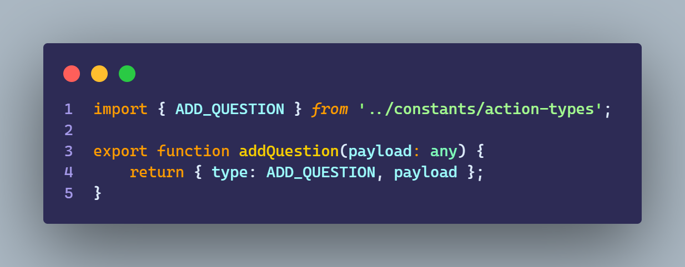
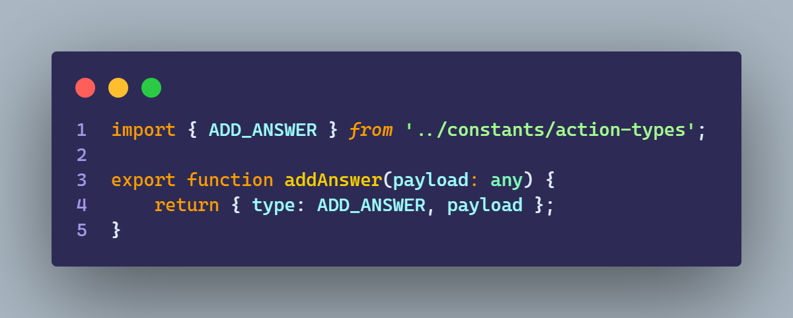
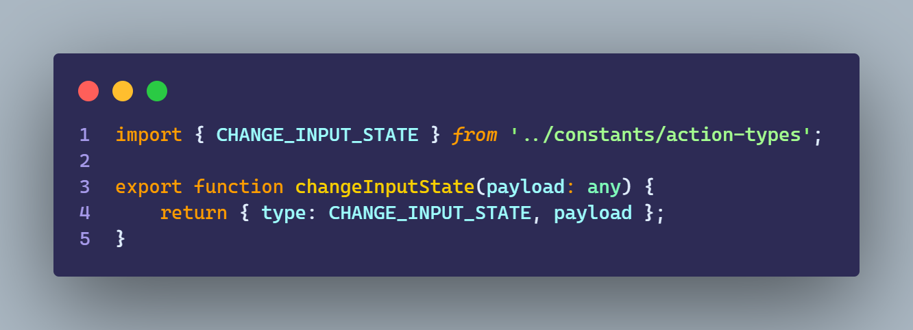
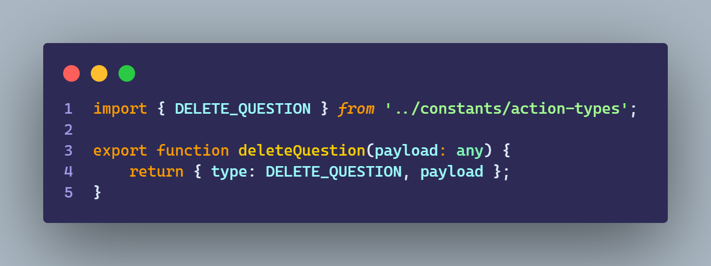
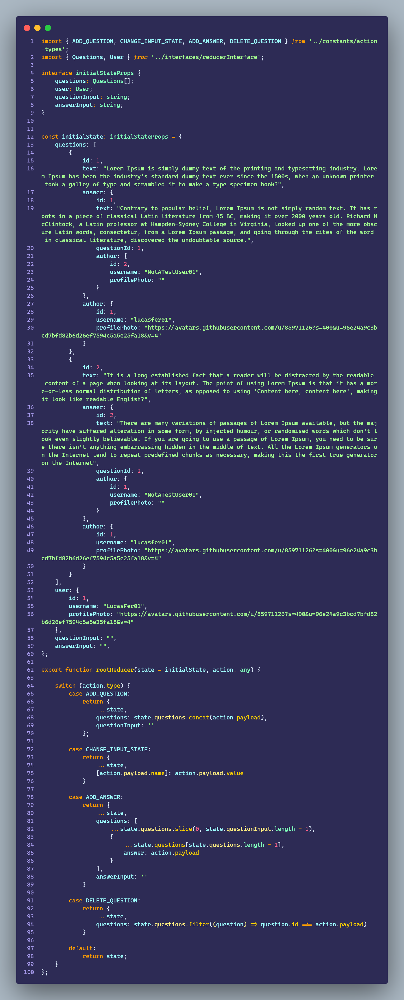
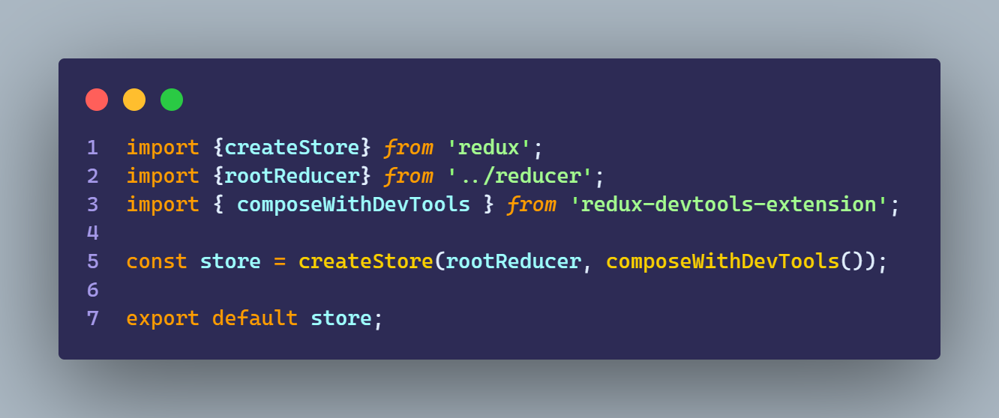

# Ejercicio 5.1

````
- Realizar un resumen de los siguientes conceptos y agregarlo al README.md:
    - action
    - reducer
    - store

- Explicar la relación entre los conceptos previamente explicados

- Realizar una aplicación que guarde el estado en store central con Redux sobre “preguntas y respuestas”

- La aplicación deberá contemplar:
    - Estado inicial con 2 preguntas y sus respuestas
    - Un formulario para carga de 1 pregunta con su respuesta
    - Un lugar donde mostrar las preguntas y respuestas
    - Un icono para quitar preguntas y sus respuestas

- Todo el mecanismo de manejo de estado debe hacer con Redux y react-redux
````

## Resultado

https://user-images.githubusercontent.com/85971126/193930613-26d8ea59-f16c-423c-8b14-11104e917fbd.mp4

<br>

# Actions

<h2>Una action es una funcion que retorna la instruccion que el reducer necesita para funcionar</h2>

<br>

## AddQuestion



<br>

## AddAnswer



<br>

## ChangeInputState



<br>

## DeleteQuestion



<br>

# Reducer

<h2>El reducer es quien realiza los cambios de estados mediante info que recibe de una action</h2>

<br>

## RootReducer



<br>

# Store

<h2>Es una referencia al estado de nuestra aplicacion, contiene la informacion mas los reducer que pueden modificar el estado</h2>

<br>

## Store


